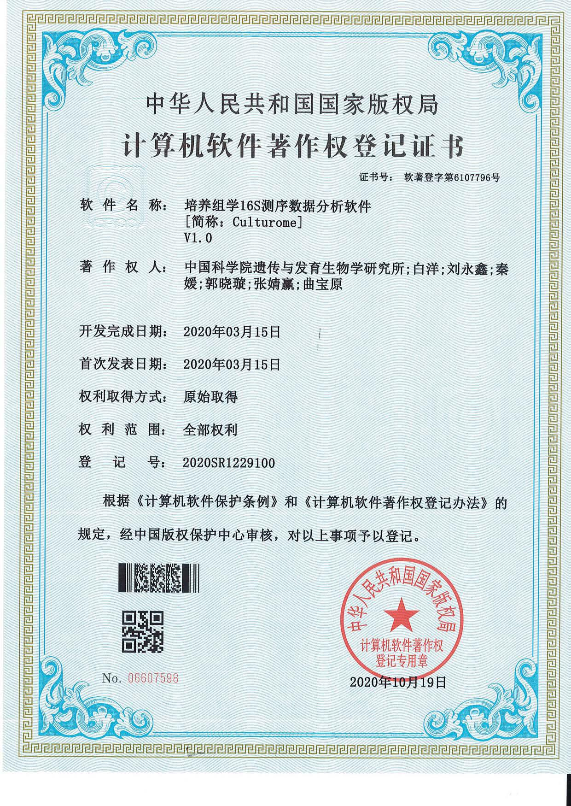

[Switch to Chinese version(切换至中文版)](http://bailab.genetics.ac.cn/yongxinliu.html)

## Basic Information


```{r icon, echo=FALSE, out.width="30%"}
figs_1 = paste0("http://bailab.genetics.ac.cn/markdown/papers/1806NRM/yongxin.jpg")
knitr::include_graphics(figs_1)
```

**Yong-Xin Liu** Ph. D.

Affiliation: Institute of Genetics and Developmental Biology Chinese Academy of Sciences

Position: Associate professor

Mobile Phone: +86-13810163414

Telephone: +86-10-64808722

E-mail:  yxliu@genetics.ac.cn

Wechat: yongxinliu

Offical Account: meta-genome https://mp.weixin.qq.com/s/5jQspEvH5_4Xmart22gjMA

CSDN Blog: https://blog.csdn.net/woodcorpse

ScienceNet Blog: http://blog.sciencenet.cn/u/woodcorpse

Github: https://github.com/YongxinLiu

Google Scholar: https://scholar.google.com/citations?user=NoxNy_IAAAAJ

Research interest: microbiome data analysis, method development and scientific communication.

---

## Biography

**Yong-Xin Liu**, Ph. D., Associate professor, memeber of Youth Innovation Promotion Association CAS, Founder of the meta-genome official account, QIIME 2 project participants。

I graduated from Northeast Agricultural University with a bachelor's degree in microbiology in 2008 and obtained a doctor's degree in bioinformatics from the University of Chinese Academy of Sciences in 2014. In 2016, I finished the post doctoral fellow of Institute of Genetic Development of Chinese Academy of Sciences to stay as an engineer. I has been a Senior Engineer (Assocation Professor) since 2021 and has been selected as a member of the Youth Promotion Association of Chinese Academy of Sciences. At present, my main research interests include microbiome data analysis, analysis method development and scientific communication.

At present, I have published 14 original research papers in [**Nature Biotechnology**](https://doi.org/10.1038/s41587-019-0104-4),  [**Nature Protocols**](https://doi.org/10.1038/s41596-020-00444-7),  [**Science China Life Sciences**](https://doi.org/10.1007/s11427-018-9284-4) and so on, as first author and / or corresponding author (including co-). Invited as first author and / or corresponding author (including co-) published 5 reviews in [**Protein & Cell**](https://doi.org/10.1007/s13238-020-00724-8), [**Current Opinion in Microbiology**](http://www.sciencedirect.com/science/article/pii/S1369527419300414), [**Genomics Proteomics & Bioinformatics**](https://doi.org/10.1016/j.gpb.2014.04.003) and so on. As co-author published 19 papers, such as in [**Science**](https://science.sciencemag.org/content/364/6440/eaau6389), [**Nature Biotechnology**](https://doi.org/10.1038/s41587-019-0209-9), [**Cell Host & Microbe**](http://www.sciencedirect.com/science/article/pii/S1931312820301682). A total of 38 articles have been published, which have been cited 4792 times (Google Scholar, by 9/23/2021).

Co-editor in collaboration with Bio-protocol Publishing House finished [*Microbiome Protocols eBook* ](https://bio-protocol.org/bio101/MPB), 101 teams participated, completed 153 peer-reviewed protocols, more than 800,000 words, and accumulated more than 300,000 readings. [*Microbiome data analysis*](https://mp.weixin.qq.com/mp/appmsgalbum?__biz=MzUzMjA4Njc1MA==&action=getalbum&album_id=1370455875005317121&scene=173&from_msgid=2247490371&from_itemidx=1&count=3#wechat_redirect) is being prepared, which is invited by Science Press.

Host 2 grants, including the National Natural Science Foundation of China-Youth Project, the Chinese Academy of Sciences Youth Innovation Promotion Association Member Project; participated in the National Natural Science Foundation-General Project, the Chinese Academy of Sciences Strategic Leading Science and Technology Special Project, and Chinese Academy of Sciences key deployment projects.

Obtained 1 software copyright. Participated in 3 China patent applications. For two consecutive years, 2019/2020 was selected as the “Outstanding Individual” of the Institute of Genetic Development, the first prize of the poster of the State Key Laboratory of Plant Genomes, and the “Union Activist” in 2019.

In July 2017, I founded the "Meta-genome" Official Account, sharing more than 2,800 original articles related to this field, and the representative works are ["Microbiome Figure Interpretation, Analysis Pipeline and Statistical Plotting"](https://mp.weixin.qq.com/s/u7PQn2ilsgmA6Ayu-oP1tw), [QIIME 2 Chinese Tutrial](https://mp.weixin.qq.com/s/-_FHxF1XUBNF4qMV1HLPkg)etc., the number of followers is 120,000+, and the cumulative reading is 24 million+.

---

## Research Interests

### Microbiome data analysis

The knowledge systems of experimental biologist and bioinformatics researchers have obvious complementary advantages. Experimental biologists have a wealth of experimental materials, superb experimental operations, strong background knowledge, etc.; bioinformatics researchers have professional skills such as data analysis, method benchmark and comparison, and description of analysis results; the difference between the two backgrounds is more conducive to interpretation the biological significance of the data. I and my collaborators have been published some papers in [**Science**](https://science.sciencemag.org/content/364/6440/eaau6389), [**Nature Biotechnology**](https://doi.org/10.1038/s41587-019-0104-4),  [**Nature Protocols**](https://doi.org/10.1038/s41596-020-00444-7), [**Cell Host & Microbe**](http://www.sciencedirect.com/science/article/pii/S1931312820301682), [**Science China Life Sciences**](https://doi.org/10.1007/s11427-018-9284-4), etc., which has been selected as a cover story, highly cited paper many times.


Figure. Example of covey story. From left to right is [**Nature Biotechnology**](https://doi.org/10.1038/s41587-019-0104-4), [**Science China Life Sciences**](https://doi.org/10.1007/s11427-018-9284-4), and [Hereditas (Beijing)](https://europepmc.org/article/med/31549683), respectively.

**Main problems and countermeasures for cooperation: **

- Communication: Usually there is a lack of understanding and communication between experimenters and analysts, clear project background and repeated communication during execution are requirements;
- Patience: The real cooperation is a long-term run-in of months to years. Don't rush for quick success, no background, and company-style standardized analysis is far from the laws of biology;
- Benefits: Different evaluation systems have different degrees of recognition of co-authors, set goals according to the rules and negotiate the distribution of benefits according to the final contribution;
- Reluctant: You can only gain if you have to give up, otherwise it is difficult to cooperate to achieve complementary advantages, break through your own ceiling, impact international leadership or create a new cross-cutting field.

**Research plan for metagenomic data analysis**

Use my own experience in amplicon and metagenomic data analysis to carry out microbiome with animal and plant phenotype association analysis, host specific metagenomic gene catalogs and genome catalogs construction, to provide description of microbiome for functional microbiome research, and to provide reference analysis methods and data basis. At present, we have cooperate published a series of articles in human, plant and environment fields. In the future, we will further cooperate with teams with large or unique resources and materials to carry out joint research. For specific scientific questions, give full play to our technical advantages by use amplicons, metagenomics, transcriptomes, metabonomics and other multi-omics methods to achieved breakthrough results at the international leading level.

### Analysis method development and optimization

At present, the field of microbiome analysis is in a stage of rapid development, methods and software are blooming; for most scientific researchers, the main problem in carrying out analysis is not that there is no software, but that there are too many softwares, and they don’t know how to choose. Limited understanding of the advantages and disadvantages of the results, the accuracy of the results cannot be grasped.

We built and shared simple, easy-to-use pipeline, including [EasyAmplicon](https://github.com/YongxinLiu/EasyAmplicon), [EasyMetagenome](https://github.com/YongxinLiu/EasyMetagenome), [Culturome](https://github.com/YongxinLiu/Culturome), which are convenient for peers to carry out data analysis. Among them, the Culturome was published in Nature Protocols in early 2021, and it was cited 14 times within 8 months. At present, each project has thousands of users, and there is a high probability of being selected as a highly cited paper within 2 years after its published.


Figure. Amplicon and metagenomic integration analysis process of microbiome


In addition, I was invited to participate in development the most widely used analysis pipeline in microbiome [QIIME 2 (Nature Biotechnology, 2019)](https://doi.org/10.1038/s41587-019-0209-9), which make me better grasp the most advanced international analysis pipeline. Cooperate in the development of plant amplicon quantification methods to realize the quantification of host plants, bacteria and fungi, and provide an absolute abundance angle to observe and compare microorganisms [(Plant Communications, 2020)](https://doi.org/10.1016/j.xplc.2019.100003). Jointly develop all-round Venn diagram drawing and statistical tools -- [EVenn](https://doi.org/10.1016/j.jgg.2021.07.007), with original network Venn style. It has been used by more than 3,000 uniq IP address users, and the article was cited twice in the first month of its published. Co-initiated and developed a server that implements more than 20 common drawing/analysis tools online —— ImageGP(http://www.ehbio.com/ImageGP/). It has been cited 232 times in the past 2 years (in preparation for submission).

**Focus on next stage**

At present, the most commonly used technologies in the field of microbiome are amplicon and metagenomic sequencing, and more than 20,000 articles are published in 2020 with an annual growth rate of 20%. The most commonly used process for amplicon sequencing is the QIIME 1/2. I have also participated in the development of QIIME 2, and it is still many shortcomings. The metagenome still lacks the mainstream analysis process, we will based on the EasyAmplicon, EasyMetagenome, and international counterparts to establish a China-led, internationally influential microbiome analysis pipeline, and maintain it for a long time, to further improve the innovation and ease of use. The goal is to establish an international influence in this field. The easy-to-use analysis process is equivalent to the construction of highways and railway in this field, which will comprehensively promote the all-round development of this field and strive to create an international academic commanding height.

Amplicon sequencing is widely used, but only focuses on description and large-scale survey of the microbiome. The era of functional microbiome research with metagenomics and metatranscriptomes is coming, and will gradually become popular with the decline of sequencing costs and the development of analytical methods. At present, metagenomics are mainly studied in environmental and fecal samples. It is still difficult to remove host contamination in animal and plant tissues. Carrying out experiments and analyzing methods to effectively remove hosts will promote metagenomic sequencing to have a wider range of application scenarios. Describe the rapid transition from the era of the microbiome to the era of the functional microbiome.

### Science communication

The current scientific research in the field of microbiome is facing a series of difficulties: the description of the article analysis method lacks details and cannot be reproduced; there are many articles like the ocean; there are many English materials but lack of systematic collation and Chinese materials; lack of examples and experience sharing, etc. Therefore, in 2017, I initiated and created the meta-genome Official Account to improve the reproducible of data analysis and solve the plight of the lack of Chinese reference in this field. After nearly 4 years of development, it currently shares 2800+ articles, more than 4 million words, 120,000+ followers, and 24 million+ readings. Become a gathering place for Chinese scientific research colleagues to share and exchange scientific research results and technical methods in this field.

In addition, I was invited by dozens of journals to share analysis methods and reviews. At present have been published reviews in [**Protein & Cell**(Highly Cited)](https://doi.org/10.1007/s13238-020-00724-8), [**Current Opinion in Microbiology**](http://www.sciencedirect.com/science/article/pii/S1369527419300414), [**Chinese Medical Journal**](https://journals.lww.com/cmj/Fulltext/9000/A_guide_to_human_microbiome_research__study.99185.aspx), [Hereditas (Beijing)](https://europepmc.org/article/med/31549683).

In order to further promote the systematic accumulation and dissemination of methods in microbiome field, open source e-books in cooperation with Bio-protocol publisher ——[Microbiome Protocol eBook 1st Edition](https://bio-protocol.org/bio101/MPB). It has been published online (https://bio-protocol.org/bio101/MPB) and continuously updated. The book "Microbiome Analysis" in cooperation with Science Press is under preparation.

- Launched in June 2020, [Microbiome Protocol eBook —— Bio-protocol](hhttps://bio-protocol.org/bio101/MPB), participated by more than 300  colleagues in this field around the world, it aims to promote the exchange and cooperation between Chinese research teams at home and abroad in the field of microbiome, and encourage research teams to pay attention to the precipitation, sharing and dissemination of experimental methods. It have been officially released online in July 2021. https://bio-protocol.org/bio101/MPB
- Launched in June 2020, [Microbiome Analysis —— Science Press](https://mp.weixin.qq.com/s/zaHjZLZCRcRgOXDgGT-mXg) , co-written by 70 Chinese colleagues in this field, focusing on the data analysis part, let everyone systematically learn background knowledge, read articles, and realize independent analysis. Nearly half of them can be read online for free. It is expected to be published in October 2022.
- Launched in May 2020 [Call for Papers on the Microbiome Special Issue —— JoVE] (https://www.jove.com/methods-collections/426/analysis-visualization-methods-for-amplicon-metagenomic-data), accumulates high-quality English experiment and analysis method videos, and promotes the development of Chinese microbiome analysis methods globalization.


Figure. Meta-genome research scope, QR code of the official account and invited to speak in China Gut

**Solutions to science communication problems**

- Advocate for articles to share reproducible codes, establish Chinese and English versions of the Microbiome Encyclopedia, to improve international influence and credibility;
- Achievement news, comprehensive interpretation and promotion of new media, to let peers understand, and at the same time improve the scientific literacy of the whole people;
- Translate or share cutting-edge technical materials, further summarize and disseminate;
- Use the "Internet +" model, analyze examples, and summarize experience. Through blogs, peers can search online, and public accounts can be pushed for peers to obtain in time. Online live broadcasts and speeches allow everyone to learn cutting-edge knowledge, technology and experience conveniently and efficiently.

**Focus on next step**

There are 137 journals in the field of microbiology indexed by SCIE by 2020, which are distributed in 21 countries/regions. Among them, the England and the USA have 43 and 38 journals respectively, and China mainland has 0 journals. The blank of high-level English journals in the field of microbiology in my country is extremely mismatched with the number of more than 3,000 microbiome articles per year. In order to solve the problem of stuck neck in academic publishing in this field of China, and gradually establish the right to speak in the publication of articles in microbiome field, in July 2021, it was initiated by Yong-Xin Liu from meta-genome and Canhui Lan of the Rexinchang Institute, and Co-Editor-in-Chief by Professor Shuangjiang Liu (Institute of Microbiology, Chinese Academy of Sciences) and Professor Jingyuan Fu (University of Groningen, Netherlands), Academician Yong-Guan Zhu (Institute of Urban Environment, Chinese Academy of Sciences), Professor Jun Yu (Chinese University of Hong Kong), Institute of Microbiology Chinese Academy of Sciences, and Gut Microbiota Branch of Chinese Biophysical Society as co-sponsors, 87 editorial board member from 12 countries /regions have co-founded the high-level journal "iMeta" in the field of microbiology and bioinformatics, which is published and distributed by Wiley, the world's largest cooperative publishing organization. The first issue, quarterly, will be issued in early 2022, with an annual publication volume of > 40 articles, with a minimum submission standard of impact factor / citation > 15 in the next year. It is expected that the first international top journal with a target impact factor > 25 will be harvested in 2024.

## Published papers

As of September 23, 2021, 38 articles have been published, which have been cited 4792 times.

"#" represents the co-first author, "\*" represents the corresponding author, IF short for impact factor.

### Representitaves (5)

3 of the 5 papers were selected as highly cited papers (Top 1%), 1 paper was selected as hot papers (Top 0.1%)

1. **Yong-Xin Liu#\***, Yuan Qin#, Tong Chen#, Meiping Lu, Xubo Qian, Xiaoxuan Guo & Yang Bai\*. (2021). A practical guide to amplicon and metagenomic analysis of microbiome data. **Protein & Cell** 12, 315-330, doi: https://doi.org/10.1007/s13238-020-00724-8 (**IF = 14.87**, Highly Cited)
2. **Yong-Xin Liu**, Yuan Qin & Yang Bai\*. (2019). Reductionist synthetic community approaches in root microbiome research. **Current Opinion in Microbiology** 49, 97-102, doi: https://doi.org/10.1016/j.mib.2019.10.010 (**IF = 8.134**)
3. Jingying Zhang#, **Yong-Xin Liu#**, Na Zhang#, Bin Hu#, Tao Jin#, Haoran Xu, Yuan Qin, Pengxu Yan, Xiaoning Zhang, Xiaoxuan Guo, Jing Hui, Shouyun Cao, Xin Wang, Chao Wang, Hui Wang, Baoyuan Qu, Guangyi Fan, Lixing Yuan, Ruben Garrido-Oter, Chengcai Chu\* & Yang Bai\*. (2019). *NRT1.1B* is associated with root microbiota composition and nitrogen use in field-grown rice. **Nature Biotechnology** 37, 676-684, doi: https://doi.org/10.1038/s41587-019-0104-4 (**IF = 54.098**, Cover Story, Highly Cited, Hot Paper)
4. Jingying Zhang#, **Yong-Xin Liu#**, Xiaoxuan Guo, Yuan Qin, Ruben Garrido-Oter\*, Paul Schulze-Lefert\*, Yang Bai\*. (2021). High-throughput cultivation and identification of bacteria from the plant root microbiota. **Nature Protocols** 16, 988-1012, doi: https://doi.org/10.1038/s41596-020-00444-7 (**IF = 13.491**)
5. Ancheng C. Huang#, Ting Jiang#, **Yong-Xin Liu**, Yue-Chen Bai, James Reed, Baoyuan Qu, Alain Goossens, Hans-Wilhelm Nützmann, Yang Bai\* & Anne Osbourn\*. (2019). A specialized metabolic network selectively modulates Arabidopsis root microbiota. **Science** 364, eaau6389, doi: https://doi.org/10.1126/science.aau6389 (**IF = 47.728**, Highly Cited)

### Other publications

6. Xubo Qian#, **Yong-Xin Liu#**, Xiaohong Ye, Wenjie Zheng, Shaoxia Lv, Miaojun Mo, Jinjing Lin, Wenqin Wang, Weihan Wang, Xianning Zhang & Meiping Lu\*. (2020). Gut microbiota in children with juvenile idiopathic arthritis: characteristics, biomarker identification, and usefulness in clinical prediction. **BMC Genomics** 21, 286, doi: https://doi.org/10.1186/s12864-020-6703-0 (**IF = 3.969**)
7. Wei Wang#, Jing Yang#, Jian Zhang, **Yong-Xin Liu**, Caiping Tian, Baoyuan Qu, Chulei Gao, Peiyong Xin, Shujing Cheng, Wenjing Zhang, Pei Miao, Lei Li, Xiaojuan Zhang, Jinfang Chu, Jianru Zuo, Jiayang Li, Yang Bai, Xiaoguang Lei\* & Jian-Min Zhou\*. (2020). An Arabidopsis secondary metabolite directly targets expression of the bacterial type III secretion system to inhibit bacterial virulence. **Cell Host & Microbe** 27, 601-613.e607, doi: https://doi.org/10.1016/j.chom.2020.03.004 (**IF = 21.023**)
8. Maosheng Zheng, Shishi He, Yueqi Feng, Mingyuan Wang, **Yong-Xin Liu**, Chenyuan Dang, Jiawen Wang\*. (2021). Active ammonia-oxidizing bacteria and archaea in wastewater treatment systems. **Journal of Environmental Sciences** 102 273-282 doi: https://doi.org/10.1016/j.jes.2020.09.039 (**IF = 5.565**)
9. Xu-Bo Qian#, Tong Chen#, Yi-Ping Xu, Lei Chen, Fu-Xiang Sun, Mei-Ping Lu\* & **Yong-Xin Liu**. (2020). A guide to human microbiome research: study design, sample collection, and bioinformatics analysis. **Chinese Medical Journal**, doi: https://doi.org/10.1097/cm9.0000000000000871 (**IF = 2.628**)
10. Xiaoxuan Guo#, Xiaoning Zhang#, Yuan Qin#, **Yong-Xin Liu**, Jingying Zhang, Na Zhang, Kun Wu, Baoyuan Qu, Zishan He, Xin Wang, Xinjian Zhang, Stéphane Hacquard, Xiangdong Fu\* & Yang Bai\*. (2020). Host-associated quantitative abundance profiling reveals the microbial load variation of root microbiome. **Plant Communications** 1, 100003, doi: https://doi.org/10.1016/j.xplc.2019.100003
11. Yali Hu#, Rui Dai#, **Yong-Xin Liu**, Jingying Zhang, Bin Hu, Chengcai Chu,, Huaibo Yuan\* & Yang Bai\*. (2020). Analysis of rice root bacterial microbiota of Nipponbare and IR24. **Hereditas(Beijing)** 42, 506-518, doi: https://doi.org/10.16288/j.yczz.20-070 (Cover story)
12. Evan Bolyen#, Jai Ram Rideout#, Matthew R. Dillon#, Nicholas A. Bokulich#, Christian C. Abnet, Gabriel A. Al-Ghalith, Harriet Alexander, Eric J. Alm, Manimozhiyan Arumugam, Francesco Asnicar, Yang Bai, Jordan E. Bisanz, Kyle Bittinger, Asker Brejnrod, Colin J. Brislawn, C. Titus Brown, Benjamin J. Callahan, Andrés Mauricio Caraballo-Rodríguez, John Chase, Emily K. Cope, Ricardo Da Silva, Christian Diener, Pieter C. Dorrestein, Gavin M. Douglas, Daniel M. Durall, Claire Duvallet, Christian F. Edwardson, Madeleine Ernst, Mehrbod Estaki, Jennifer Fouquier, Julia M. Gauglitz, Sean M. Gibbons, Deanna L. Gibson, Antonio Gonzalez, Kestrel Gorlick, Jiarong Guo, Benjamin Hillmann, Susan Holmes, Hannes Holste, Curtis Huttenhower, Gavin A. Huttley, Stefan Janssen, Alan K. Jarmusch, Lingjing Jiang, Benjamin D. Kaehler, Kyo Bin Kang, Christopher R. Keefe, Paul Keim, Scott T. Kelley, Dan Knights, Irina Koester, Tomasz Kosciolek, Jorden Kreps, Morgan G. I. Langille, Joslynn Lee, Ruth Ley, **Yong-Xin Liu**, Erikka Loftfield, Catherine Lozupone, Massoud Maher, Clarisse Marotz, Bryan D. Martin, Daniel McDonald, Lauren J. McIver, Alexey V. Melnik, Jessica L. Metcalf, Sydney C. Morgan, Jamie T. Morton, Ahmad Turan Naimey, Jose A. Navas-Molina, Louis Felix Nothias, Stephanie B. Orchanian, Talima Pearson, Samuel L. Peoples, Daniel Petras, Mary Lai Preuss, Elmar Pruesse, Lasse Buur Rasmussen, Adam Rivers, Michael S. Robeson, Patrick Rosenthal, Nicola Segata, Michael Shaffer, Arron Shiffer, Rashmi Sinha, Se Jin Song, John R. Spear, Austin D. Swafford, Luke R. Thompson, Pedro J. Torres, Pauline Trinh, Anupriya Tripathi, Peter J. Turnbaugh, Sabah Ul-Hasan, Justin J. J. van der Hooft, Fernando Vargas, Yoshiki Vázquez-Baeza, Emily Vogtmann, Max von Hippel, William Walters, Yunhu Wan, Mingxun Wang, Jonathan Warren, Kyle C. Weber, Charles H. D. Williamson, Amy D. Willis, Zhenjiang Zech Xu, Jesse R. Zaneveld, Yilong Zhang, Qiyun Zhu, Rob Knight & J. Gregory Caporaso\*. (2019). Reproducible, interactive, scalable and extensible microbiome data science using QIIME 2. **Nature Biotechnology** 37, 852-857, doi: https://doi.org/10.1038/s41587-019-0209-9 (**IF = 54.908**)
13. Maosheng Zheng, Nan Zhou, Shufeng Liu, Chenyuan Dang, **Yong-Xin Liu**, Shishi He, Yijun Zhao, Wen Liu & Xiangke Wang\*. (2019). N2O and NO emission from a biological aerated filter treating coking wastewater: Main source and microbial community. **Journal of Cleaner Production** 213, 365-374, doi: https://doi.org/10.1016/j.jclepro.2018.12.182 (**IF = 9.297**)
14. Qingwen Chen#, Ting Jiang#, **Yong-Xin Liu**, Haili Liu, Tao Zhao, Zhixi Liu, Xiaochao Gan, Asis Hallab, Xuemei Wang, Juan He, Yihua Ma, Fengxia Zhang, Tao Jin, M.Eric Schranz, Yong Wang, Yang Bai\* & Guodong Wang\*. (2019). Recently duplicated sesterterpene (C25) gene clusters in Arabidopsis thaliana modulate root microbiota. Science China Life Sciences 62, 947-958, doi: https://doi.org/10.1007/s11427-019-9521-2 (**IF = 6.038**)
15. **Yong-Xin Liu**, Yuan Qin, Xiaoxuan Guo & Yang Bai\*. (2019). Methods and applications for microbiome data analysis. **Hereditas(Beijing)** 41, 845-826, doi: https://doi.org/10.16288/j.yczz.19-222
16. Jingying Zhang#, Na Zhang#, **Yong-Xin Liu#**, Xiaoning Zhang, Bin Hu, Yuan Qin, Haoran Xu, Hui Wang, Xiaoxuan Guo, Jingmei Qian, Wei Wang, Pengfan Zhang, Tao Jin\*, Chengcai Chu\* & Yang Bai\*. (2018). Root microbiota shift in rice correlates with resident time in the field and developmental stage. Science China Life Sciences 61, 613-621, doi: https://doi.org/10.1007/s11427-018-9284-4 (**IF = 6.038**, Cover Story)
17. Wei Wang#, Bin Hu#, Dingyang Yuan, Yongqiang Liu, Ronghui Che, Yingchun Hu, Shujun Ou, Zhihua Zhang, Hongru Wang, Hua Li, Zhimin Jiang, Zhengli Zhang, Xiaokai Gao, Yahong Qiu, Xiangbing Meng, **Yong-Xin Liu**, Yang Bai, Yan Liang, Yi-Qin Wang, Lianhe Zhang, Legong Li, Sodmergen Sodmergen, Hai-Chun Jing, Jiayang Li & Chengcai Chu\*. (2018). Expression of the nitrate transporter gene OsNRT1.1A/OsNPF6.3 confers high yield and early maturation in rice. **The Plant Cell** 30, 638-651, doi: https://doi.org/10.1105/tpc.17.00809 (**IF = 11.277**, Highly Cited)
18. Handong Su#, Yalin Liu#, **Yong‐Xin Liu**, Zhenling Lv, Hongyao Li, Shaojun Xie, Zhi Gao, Junling Pang, Xiu‐Jie Wang, Jinsheng Lai & Fangpu Han\*. (2016). Dynamic chromatin changes associated with de novo centromere formation in maize euchromatin. **The Plant journal** 1, 1-17, doi: https://doi.org/10.1111/tpj.13305 (**IF = 6.417**)
19. Tong Chen, Haiyan Zhang, Yu Liu, **Yong-Xin Liu**\*, Luqi Huang*. (2021). EVenn: Easy to create repeatable and editable Venn diagrams and Venn networks online. **Journal of Genetics and Genomics**, doi: https://doi.org/10.1016/j.jgg.2021.07.007 (**IF = 5.065**)
20. Zhiyao Lv#, Rui Dai#, Haoran Xu#, **Yong‐Xin Liu**, Bo Bai, Ying Meng, Haiyan Li, Xiaofeng Cao*, Yang Bai*, Xianwei Song*, Jingying Zhang*. (2021). The rice histone methylation regulates hub species of the root microbiota. **Journal of Genetics and Genomics**, doi: https://doi.org/10.1016/j.jgg.2021.06.005
21. **Yong-Xin Liu**, Meng Wang & Xiu-Jie Wang\*. (2014). Endogenous small RNA clusters in plants. **Genomics Proteomics Bioinformatics** 12, 64-71, doi: https://doi.org/10.1016/j.gpb.2014.04.003 (**IF = 7.691**)
22. Jing Li, **Yong-Xin Liu**, Ying-peng Han, Yong-guang Li, Mao-zu Guo & Wen-bin Li\*. (2013). MicroRNA primary transcripts and promoter elements analysis in soybean (Glycine max L. Merril.). **Journal of Integrative Agriculture** 12, 1522-1529, doi: https://doi.org/http://dx.doi.org/10.1016/S2095-3119(13)60500-6 (**IF = 2.848**)
23. **Yong-Xin Liu**, Wei Chang, Ying-peng Han, Quan Zou, Mao-zu Guo & Wen-bin Li\*. (2011). In silico detection of novel microRNAs genes in soybean genome. **Agricultural Sciences in China** 10, 1336-1345, doi: https://doi.org/10.1016/S1671-2927(11)60126-0 (**IF = 2.848**)

My latest and complete published papers and citation status, see my Google Scholar: https://scholar.google.com/citations?user=NoxNy_IAAAAJ

---

## Book

### Microbiome Protocol eBook

The MPB was launched by Bio-protocol editorial office China and WeChat subscription "meta-genome", one of the largest microbiome communities with more than 118,000 members (June 2021). The Bio-protocol journal provides peer-reviewed and open access publication with free of charge. The MPB aims to promote the communications and cooperation between researchers and research teams to summarize, share, and dissemination the protocols in the microbiome area. We hope this project will bridge the gaps in microbiome protocols, and to solve the problems of wet experiments and data analysis, and to prepare for the accumulation of standard data for big data integrated analysis soon. In summary, the MPB will greatly facilitate the development of the microbiome area. All protocols are hosted in Bio-101, a sister website of the Bio-protocol Journal. The project homepage link is https://bio-protocol.org/bio101/mpb.

The topics of MPB are the protocols of microbiome, including culturome3, amplicon4, metagenome, metatranscriptome5, virome, metaproteome, metabolome, microbe genome, related molecular biology and microbiology experiments, and the upstream and downstream related experiments and analysis of microbiome (Figure 1). According to the research objects, it mainly includes the microbiome in humans, animals, plants, environment, soil, water, bacteria, fungi, viral and so on (Figure 1). According to the research methods, it mainly includes sample preparation, nucleic acid extraction, protein and metabolite extraction, sequencing library preparation, microbial culture and identification, synthetic community, axenic system, data analysis, and general microbiology experiments and analysis (Figure 1).


Figure 1. Microbiome Protocols eBook—Building a bridge to microbiome research. The establishment and optimization of a variety of microbiome protocols, make it possible to study microbiome of humans, animals, plants, and the environment.

Since the first announcement of MPB in July 2020, 357 researchers from 101 Institutes or Universities have been involved in this project, including the Chinese Academy of Sciences (Institute of Genetics and Developmental Biology, Institute of Soil Science, Institute of Microbiology, Research Center for Eco-Environmental Sciences, and Institute of Urban Environment, Institute of Applied Ecology, Nanjing Institute of Geography & Limnology, Institut Pasteur of Shanghai, etc), Chinese Academy of Agricultural Sciences, Peking University, Tsinghua University, Zhejiang University, Sun Yat-sen University, China Agricultural University, Shandong University, Yangzhou University, Westlake University, Nanjing Agricultural University, etc. At present, MPB 1st edition has published 129 protocols and the collection will be released soon. MPB is open-access, and anyone can access it through various channels such as the Bio-protocol Journal (https://bio-protocol.org/), WeChat subscription "meta-genome", CSDN blog, etc.

To keep the quality, diversity, and timeliness, the MPB is set up as a long-term project and plan to update biennially. The published protocols can be found on the project homepage. We sincerely invite more researchers to participate in this project. Any protocols related to the microbiome are welcome, especially for the commonly used or cutting-edge protocols. If you want to contribute or have any questions, please contact us via email (metagenome@126.com) or WeChat (ID: meta-genomics). We hope MPB becomes a protocol encyclopedia and helpful tool for microbiome researches.

Homepage: https://bio-protocol.org/bio101/MPB


Figure. Microbiome Protocols eBook 1st Edition (ISBN: 978-1-951285-03-6)

### Microbiome analysis

"Microbiome Analysis", signed a cooperation agreement with Science Press in June 2020, and is currently in progress!

Advances in high-throughput sequencing (HTS) have fostered rapid developments in the field of microbiome research, and massive microbiome datasets are now being generated. However, the diversity of software tools and the complexity of analysis pipelines make it difficult to access this field. Here, we systematically summarize the advantages and limitations of microbiome methods. Then, we recommend specific pipelines for amplicon and metagenomic analyses, and describe commonly-used software and databases, to help researchers select the appropriate tools. Furthermore, we introduce statistical and visualization methods suitable for microbiome analysis, including alpha- and beta-diversity, taxonomic composition, difference comparisons, correlation, networks, machine learning, evolution, source tracing, and common visualization styles to help researchers make informed choices. Finally, a step-by-step reproducible analysis guide is introduced. We hope this review will allow researchers to carry out data analysis more effectively and to quickly select the appropriate tools in order to efficiently mine the biological significance behind the data.


Figure. Overview of statistical and visualization methods for feature tables.

---

## Grants

Category |Name |Number |Type of Participation |Start Time |End Time |Contract Expenses (10,000 yuan)
:--------------------------------------|:-----------------------------------------------------------------------------|:---------------|:-----------|:-----------|:-----------|:-----------------------
National Natural Science Foundation of China-Youth Project | Research on DNA Methylation of Maize Neocentromere |31500992 |Host |2016.1 |2018.12 |20
Chinese Academy of Sciences-Youth Innovation Promotion Association Member Project |Root Microbiome |2021092 |Host |2021.1 |2024.12 |80
Strategic Leading Technology Special Class A |RNA-mediated Somatic Cell Reprogramming Technology |XDA01020101 |Participate |2011.5 |2021.12 |709.89
National Natural Science Foundation of China-General Project | Systematic Analysis and Functional Research of Eukaryotic Gene Conservation |Y313011 |Participate |2013.1 |2016.12 |100
Key Research Projects of Frontier Science of the Chinese Academy of Sciences | Research on the Structure and Function of Crops Rhizosphere Microbiota | QYZDB-SSW-SMC021|Participate |2017.1 |2020.12 |250
Strategic Leading Technology Special Category B | The function of root microbiome in crop disease resistance and nutritional efficiency |XDB11020700 |Participate |2017.1 |2019.12 |135
National Natural Science Foundation of China-General Project | Association analysis of yield-related traits and root microbiome of 203 rice core varieties |31772400 |Participate |2018.1 |2021.12 |60
Key deployment project of Chinese Academy of Sciences | Structure and function analysis of halophyte root microbiome | KFZD-SW-112 | Participate |2018.1 |2019.12 |75
Strategic Leading Technology Special Class A |Cross-border Improvement Technology |XDA24020104 |Participate |2019.1 |2024.12 |94.98

## Speaker

Report date    |Location                       |Conference                                                                                           |Report title                                                                                 |Type
:-----------|:--------------------------|:----------------------------------------------------------------------------------------------|:----------------------------------------------------------------------------------------|:-----------
2018/11/12 |Hangzhou, Zhejiang |The 370th China Association for Science and Technology Forum for Young Scientists: Crop-microbiome and plant interactions and ecological safety |Root microbiome and plant interactions revealed by metagenomic sequencing and cultivation|Special report
2019/5/25 |Beijing Renmin University | The 12th China R Conference (Beijing) Visualization Session | Application of R Language in Statistical Analysis and Visualization of Metagenomic Data | Special Report
2019/6/30 |Online | TopEdit | Analysis and visualization routines of high-level omics articles | Invited report
2019/7/18 |Beijing Global Trade Center |Lecture |Introduction Guide to Microbiome Analysis |Invited Lecture
2019/9/5 |Online | Biomark | Analysis and visualization of high-level microbiome projects | Invited report
2019/12/7 |Beijing Institute of Microbiology, Chinese Academy of Sciences | China Microbiome Research Status and Countermeasures Symposium Invitation Letter | Microbiome Analysis Methods, Application and Science Communication | Invited Report
2019/12/14 | Shijiazhuang, Hebei | The Fifth Plant Physiology and Food Security Expert Forum in Hebei Province | Research Methods and Applications of Plant Microbiome | Invited Report
2020/6/17 |Online |CGM Online Salon |Microbiome Data Analysis and Visualization |Invited Report
2020/10/27 | Nanjing, Jiangsu | Frontier Symposium on Soil Ecology | Amplicon and Metagenomic Data Analysis Process and Visualization Scheme | Special Report
2020/11/29 |Beijing |Intestinal Lecture | Microbiome Data Analysis and Visualization Actual Combat | Special Report
2020/12/8 |Online | Microbiology Special Report by National Institute of Green Development of Agriculture, China Agricultural University | Opportunities and Challenges of Metagenomic Data Analysis | Special Report
2021/5/27 | Nanjing, Jiangsu | China Gut Conference | Microbiome Data Analysis Process and Interpretation of Results | Conference Convener and Speaker
2021/6/4 |Beijing |The 3rd Youth Life Science Forum |Amplicon and Metagenomic Data Analysis and Visualization |Sub-forum Convener and Speaker
2021/6/23 | Hefei, Anhui | Seminar on Soil Biodiversity and Biochemical Process | Microbiome Data Analysis and Interpretation of Results | Special Report

---

## Journal

### Host journal

The initiator and executive editor of "iMeta" Journal, aiming to be the first top journal in the field with an impact factor > 15. Mainly publish metaomics-related research, software and databases, review articles, etc. The software requires strong ease of use and long-term maintenance. The review requires the knowledge system summarized for a certain topic and the outlook for the future development direction, in order to share valuable publication, serve the peers, improve the efficiency of scientific research, and promote the output of more original researches.

Negotiations with cooperative publisher are currently underway. It is expected to be officially published in 2022, with an annual publication volume of 40-100 articles. So far, nearly 100 teams have completed the invited, and 15 drafts manuscripts have been obtained. Various highly cited methods, WebServer , reviews are targeted creation!

### Cooperative Journal

- Genomics Proteomics & Bioinformatics —— Cooperative media
- Journal of Genetics and Genomics —— Cooperative media
- Jove-Journal of Visualized Experiments: [Analysis and visualization methods for amplicon and metagenomic data of microbiome](https://www.jove.com/methods-collections/426/analysis-visualization-methods-for-amplicon-metagenomic-data)
- Medicine in Microecology —— Cooperative media
- Soil Ecology Letter —— Cooperative media
- The Innovation —— Cooperative media, Youth Editors

### Reviewers

As reviewers in more than 10 journals in this field, and review more than 30 papers.

- Bio101
- Bio-protocol
- Bioinformatics
- BMC Bioinformatics
- BMC Genomics
- Cell Host Microbe
- Frontiers in Plant Science
- ISME Journal
- Journal of Genetics and Genomics
- Journal of Integrative Plant Biology
- Jove-Journal of Visualized Experiments
- Medicine in Microecology
- Microbiome
- Nature Microbiology
- Nature Plants
- Soil Biology & Biochemistry
- Scientific Reports

---

## Society Memberships

- Meta-genome official account: Founder and Editor-in-Chief
- Bio-data official account: Associate editor in metagenomics
- Rexinchange Daily: Associate editor in bioinformatics
- iMeta science organization: Founder and Executive Editor
- Gut microbiome Branch of the Biophysical Society: Member

---

## Other achievements


### Honors

Time | Award name | Issuing agency
:---------|:-------------------------------------------|:------------------------------------------
2005/11/23|Outstanding Student Leader |Northeast Agricultural University
2007/11/1 | Three Good Students and Second-class Scholarship for Comprehensive Quality | Northeast Agricultural University
2008/6/1 | Outstanding Graduates of Heilongjiang Province General Colleges and Universities | Heilongjiang Provincial Department of Education
2012/12/12|The Eighth Outstanding Master's Thesis of Heilongjiang Province | Heilongjiang Provincial Department of Education
2019/8/11 | First Prize of Summer Youth Academic Forum Poster | State Key Laboratory of Plant Genomics
2019/9/1 | Trade Union Activist | Trade Union Committee of Institute of Genetics and Developmental Biology, Chinese Academy of Sciences
2020/1/3 | Outstanding Individual of 2019 | Institute of Genetics and Developmental Biology, Chinese Academy of Sciences
2020/11/21|First Prize of Winter Youth Academic Forum Poster | State Key Laboratory of Plant Genomics
1/3/2021 | Outstanding Individual of 2020 | Institute of Genetics and Developmental Biology, Chinese Academy of Sciences

### Software copyright

Institute of Genetics and Developmental Biology, Chinese Academy of Sciences, Yang Bai, **Yong-Xin Liu**, Yuan Qin, Xiaoxuan Guo, Jingying Zhang, Baoyuan Qu. (2020). 16S sequencing data analysis software for culturome. **Software author Zi No. 6107796**, China, 2020SR1229100



### Patent

There are 3 patents currently under application.

- Yang Bai, Jingying Zhang, **Yong-Xin Liu**, Baoyuan Qu. (2020). A method for isolating and cultivating tomato root microbiome and the resulting tomato root microbiome. **Invention Patent 202010401436.7**, China, 13 May 2020. Acceptance
- Yang Bai, Jingying Zhang, **Yong-Xin Liu**, Baoyuan Qu. (2020). A high-throughput isolation and culture method for crop root microbiome. **Invention patent 202010401434.8**, China, May 13, 2020 Acceptance
- Yang Bai, Jingying Zhang, Bai Bo, **Yong-Xin Liu**, Baoyuan Qu. (2020). A strain of Klebsiella rhizosphere and its application. **Invention patent 202011588422.7**, China, December 29, 2020 Acceptance

---

© 2016-2022 Yong-Xin Liu