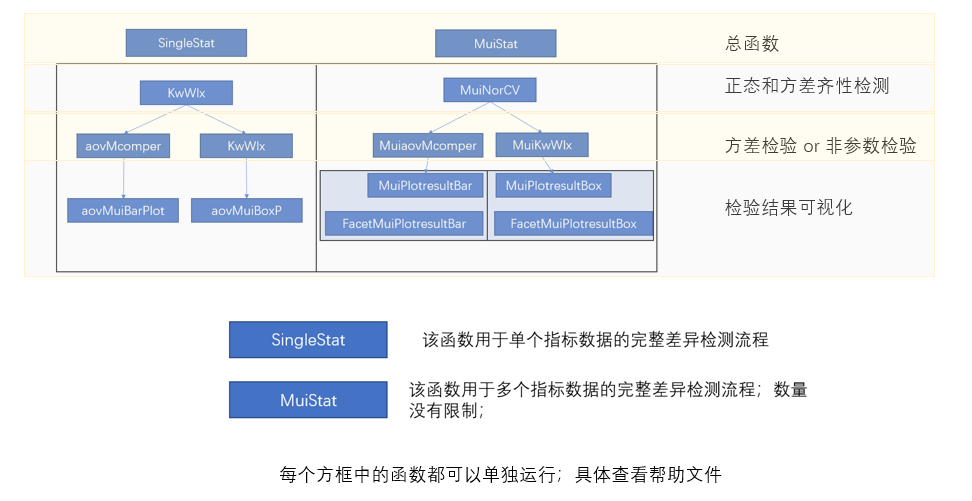

```{css include=FALSE}
 pre code,pre,code {
 white-space:pre!important;
 overflow-x: scroll!important; 
} 
```

```{r setup, include=FALSE}
knitr::opts_chunk$set(echo = TRUE,
                      fig.width = 7,
                      fig.height = 5,
                      fig.align = "center",
                      warning = FALSE,
                      message = FALSE
                      
                      )
```

# 差异分析完整解决方案

## EasyAovWlxPlot 使用指南

安装EasyAovWlxPlot包
```{R}
library(devtools)
# install_github("taowenmicro/EasyAovWlxPlot")

```

导入包
```{R}
library(EasyAovWlxPlot)
library(ggplot2)
#使用内置数据
data(data_wt)
```



### 基于单个指标的统计分析

正态检验和方差齐性分析
```{R}
# ?NorNorCVTest
##使用案例
NorCV = NorNorCVTest(data = data_wt, i= 4,method_cv = "leveneTest")
#提取正态检验结果
NorCV[[1]]
#提取方差齐性检验结果
NorCV[[2]]

```

### 方差分析(aovMcomper)

- data:输入数据框，第一列为样本编号，第二列为分组，注意分组标签必须设定为group，第三列以后就是妮妮测定或者收集的指标了

- i:代表您想要进行统计的列，比如：第三列：i = 3

- method_Mc:选择需要使用的多重比较方法，这里又多种方法可供选择：method_Mc == "LSD";method_Mc == "SNK";method_Mc == "Duncan";method_Mc == "scheffe"
```{R}
# ?aovMcomper
result= aovMcomper (data = data_wt, i= 5,method_Mc = "Tukey")
# 提取多重比较结果
result[[1]]
#提取方差检验结果
result[[2]]
```
### 非参数检验
两个参数代表的意义与方差分析的两个相同；

- data:输入数据框，第一列为样本编号，第二列为分组，注意分组标签必须设定为group，第三列以后就是妮妮测定或者收集的指标了

- i:代表您想要进行统计的列，比如：第三列：i = 3


```{R}
# ?KwWlx
res = KwWlx(data = data_wt, i= 4)
# 调用非参数两两比较结果：字母标记展示
res[[1]]
#表格展示两两之间差异结果
res[[2]]


```

### 柱状图展示方差分析或非参数检验结果（aovMuiBarPlot）

- data：输入数据框，第一列为样本编号，第二列为分组，注意分组标签必须设定为group，第三列以后就是测定或者收集的指标了

- i：代表您想要进行统计的列，比如：第三列：i = 3

- sig_show：代表差异展示方式；sig_show ="abc"是使用字母表示;sig_show ="line"是使用连线和星号表示；如果是NA，那么就不显示显著性结果

- result：代表显著性差异分析结果，是一个数据框，第一列是显著性差异字母，第二列是分组group

```{R}
# ?aovMuiBarPlot
###----使用方差检验结果和多重比较结果做展示：  柱状图展示
PlotresultBar = aovMuiBarPlot(data = data_wt, i= 3,sig_show ="abc",result = result[[1]])
#提取结果
PlotresultBar[[1]]
#提取方差分析或非参数检验结果
PlotresultBar[[2]]
```
#### 柱状图展示方差分析或非参数检验结果（aovMuiBoxP）

- data：输入数据框，第一列为样本编号，第二列为分组，注意分组标签必须设定为group，第三列以后就是测定或者收集的指标了

- i：代表您想要进行统计的列，比如：第三列：i = 3

- sig_show：代表差异展示方式；sig_show ="abc"是使用字母表示;sig_show ="line"是使用连线和星号表示；如果是NA，那么就不显示显著性结果

- result：代表显著性差异分析结果，是一个数据框，第一列是显著性差异字母，第二列是分组group

```{R}
# ?aovMuiBoxP
# #使用案例
PlotresultBox = aovMuiBoxP(data = data_wt, i= 3,sig_show ="abc",result = result[[1]])
#提取图片
p = PlotresultBox[[1]]
p
# 提取检验结果
PlotresultBox[[2]]
```

### 多个指标同时做正态检验和方差齐性分析（MuiNorCV）

这里对多组数据进行分析，结果我是用T或F代表，方便阅读。

- data：输入数据框，第一列为样本编号，第二列为分组，注意分组标签必须设定为group，第三列以后就是测定或者收集的指标了

- num：代表您想要进行统计的列,这里可以输入多个列，只需要指定列号即可：例如：num = c(4:6)

- method_cv：代表选择方差齐性的方法，有两种可供选择：method_cv == "bartlett.test" ;method_cv == "leveneTest"
```{R}
dim(data_wt)
# ?MuiNorCV
# 使用案例
norCv = MuiNorCV(data = data_wt,num = c(4:10),method_cv = "leveneTest")
#展示正态检验和方差齐性结果
norCv

```

#### 多个指标方差检验（MuiaovMcomper）

- data：输入数据框，第一列为样本编号，第二列为分组，注意分组标签必须设定为group，第三列以后就是妮妮测定或者收集的指标了

- num：代表您想要进行统计的列,这里可以输入多个列，只需要指定列号即可：例如：num = c(4:6)

- method_Mc：选择需要使用的多重比较方法，这里又多种方法可供选择：method_Mc == "LSD";method_Mc == "SNK";method_Mc == "Duncan";method_Mc == "scheffe"


```{R}
# ? MuiaovMcomper
# #使用案例
result = MuiaovMcomper(data = data_wt,num = c(4:6),method_Mc = "Tukey")
#提取每个指标方差检验多重比较结果
result

```

### 多个指标非参数检验（MuiKwWlx）

- data：输入数据框，第一列为样本编号，第二列为分组，注意分组标签必须设定为group，第三列以后就是测定或者收集的指标了

- num：代表您想要进行统计的列,这里可以输入多个列，只需要指定列号即可：例如：num = c(4:6)

```{R}
# ? MuiKwWlx
# #使用案例
result = MuiKwWlx(data = data_wt,num = c(4:6))
#提取每个指标非参数检验多重比较结果
result

```

### 多组数据可视化差异分析结果： 柱状图（MuiPlotresultBar）

我让该函数自动保存每个指标的出图文件到当前文件夹中。这些文件以该指标名称命名；


- data：输入数据框，第一列为样本编号，第二列为分组，注意分组标签必须设定为group，第三列以后就是妮妮测定或者收集的指标了

- num：代表您想要进行统计的列,这里可以输入多个列，只需要指定列号即可：例如：num = c(4:6)

- sig_show：代表差异展示方式；sig_show ="abc"是使用字母表示;sig_show ="line"是使用连线和星号表示；如果是NA，那么就不显示显著性结果

- result：代表显著性差异分析结果，是一个数据框，每一列是显著性标记字母,MuiKwWlx

```{R}
# ?MuiPlotresultBar
# # #使用案例
result = MuiKwWlx(data = data_wt,num = c(4:6))
result
# #结果直接输出到文件夹中
MuiPlotresultBar(data = data_wt,num = c(4:6),result = result ,sig_show ="line")


```

### 多组数据可视化差异分析结果：箱线图（MuiPlotresultBox）

我让该函数自动保存每个指标的出图文件到当前文件夹中。这些文件以该指标名称命名；


- data：输入数据框，第一列为样本编号，第二列为分组，注意分组标签必须设定为group，第三列以后就是妮妮测定或者收集的指标了

- num：代表您想要进行统计的列,这里可以输入多个列，只需要指定列号即可：例如：num = c(4:6)

- sig_show：代表差异展示方式；sig_show ="abc"是使用字母表示;sig_show ="line"是使用连线和星号表示；如果是NA，那么就不显示显著性结果

- result：代表显著性差异分析结果，是一个数据框，每一列是显著性标记字母,MuiKwWlx
```{R}
# ?MuiPlotresultBox
#使用案例
result = MuiKwWlx(data = data_wt,num = c(4:8))
result
# #直接出图到文件夹中
MuiPlotresultBox(data = data_wt,num = c(4:8),result = result,sig_show ="abc")

```

#### 差异结果展示：分面展示柱状图：(FacetMuiPlotresultBar)

- data：输入数据框，第一列为样本编号，第二列为分组，注意分组标签必须设定为group，第三列以后就是妮妮测定或者收集的指标了

- num：代表您想要进行统计的列,这里可以输入多个列，只需要指定列号即可：例如：num = c(4:6)

- sig_show：代表差异展示方式；sig_show ="abc"是使用字母表示;sig_show ="line"是使用连线和星号表示；如果是NA，那么就不显示显著性结果

- result：代表显著性差异分析结果，是一个数据框，每一列是显著性标记字母,MuiKwWlx
- ncol:代表分面展示每一行放几张图
```{R}
# ?FacetMuiPlotresultBar
# # #使用案例
result = MuiaovMcomper(data = data_wt,num = c(4:10),method_Mc = "Tukey")
result
result1 = FacetMuiPlotresultBar(data = data_wt,num = c(4:10),result = result,sig_show ="abc",ncol = 4 )
result1[[1]]

```

### 差异结果展示：分面展示柱状图：(FacetMuiPlotresultBox)

- data：输入数据框，第一列为样本编号，第二列为分组，注意分组标签必须设定为group，第三列以后就是妮妮测定或者收集的指标了

- num：代表您想要进行统计的列,这里可以输入多个列，只需要指定列号即可：例如：num = c(4:6)

- sig_show：代表差异展示方式；sig_show ="abc"是使用字母表示;sig_show ="line"是使用连线和星号表示；如果是NA，那么就不显示显著性结果

- result：代表显著性差异分析结果，是一个数据框，每一列是显著性标记字母,MuiKwWlx
- ncol:代表分面展示每一行放几张图
```{R}
# ?FacetMuiPlotresultBox
# #使用案例
result = MuiaovMcomper(data = data_wt,num = c(4:10),method_Mc = "Tukey")
result
#
result1 = FacetMuiPlotresultBox(data = data_wt,num = c(4:10),result = result,sig_show ="abc",ncol = 2 )
result1[[1]]

```

### 单个指标一体化分析（SingleStat）

这个函数可以将我们的目标列做正态检验和方差齐性，然后根据结果选择方差检验或者多重比较方法，最后选择自己需要的出图方式和显著性标记方式展示。

- data：输入数据框，第一列为样本编号，第二列为分组，注意分组标签必须设定为group，第三列以后就是妮妮测定或者收集的指标了

- i：代表您想要进行统计的列，比如：第三列：i = 3

- method_Mc：选择需要使用的多重比较方法，这里又多种方法可供选择：method_Mc == "LSD";method_Mc == "SNK";method_Mc == "Duncan";method_Mc == "scheffe"

- plot：可以选择需要的出图类型，柱状图和箱线图


```{R}
# ?SingleStat
# # #使用案例
# #输出结果第一个为图片，第二个是统计结果，第三个是统计方法
result = SingleStat(data = data_wt,plot = "bar",method_Mc = "Tukey",i= 4,sig_show ="abc")
# #导出图片
p = result[[1]]
p

```

### 多个指标一体化分析(MuiStat)

实现了多个指标批量整体运行；这个函数可以将我们的目标列做正态检验和方差齐性，然后根据结果选择方差检验或者多重比较方法，最后选择自己需要的出图方式和显著性标记方式展示。

data：输入数据框，第一列为样本编号，第二列为分组，注意分组标签必须设定为group，第三列以后就是妮妮测定或者收集的指标了

num：代表您想要进行统计的列,这里可以输入多个列，只需要指定列号即可：例如：num = c(4:6)

method_cv：代表选择方差齐性的方法，有两种可供选择：method_cv == "bartlett.test" ;method_cv == "leveneTest"

method_Mc：选择需要使用的多重比较方法，这里又多种方法可供选择：method_Mc == "LSD";method_Mc == "SNK";method_Mc == "Duncan";method_Mc == "scheffe"

plot：可以选择需要的出图类型，柱状图和箱线图

sig_show：代表差异展示方式；sig_show ="abc"是使用字母表示;sig_show ="line"是使用连线和星号表示；如果是NA，那么就不显示显著性结果

ncol：代表分面展示每一行放几张图

plottype：输出图形是分面展示plottype =mui，还是单张展示:plottype == "single"

```{R}
# ?MuiStat
#使用案例
result = MuiStat(data = data_wt,num = c(4:10),method_cv = "leveneTest",method_Mc = "Tukey",sig_show  = "abc",ncol = 4,plot = "box",plottype = "mui")
result[[1]]
```


