---
title: "animalcules包学习"
author: "wentao"
date: "2020/6/27"
output: html_document
---


```{css include=FALSE}
 pre code,pre,code {
 white-space:pre!important;
 overflow-x: scroll!important; 
} 
```

```{r setup, include=FALSE}
knitr::opts_chunk$set(echo = TRUE,
                      fig.width = 7,
                      fig.height = 5,
                      fig.align = "center",
                      warning = FALSE,
                      message = FALSE
                      
                      )
```

### 写在前面


这个包最优雅的地方在于交互式，所以学习的主要目的也就是交互式的实践。

首先我查看了作者的介绍：这是发表过nature的大牛。很年轻，这几年刚起来，应用数量指数上涨，很有潜力。很值得学习。
> https://scholar.google.com/citations?user=pLIF9tUAAAAJ&hl=zh-CN

### 作者信息

- Yue Zhao <sup>1,2</sup>
- Anthony Federico <sup>1,2</sup>
- Evan Johnson <sup>1,2</sup>

- <sup>1</sup> Boston University School of Medicine, Boston, MA
- <sup>2</sup> Bioinformatics Program, Boston University, Boston, MA

### 介绍

animalcules 包专注与微生物组数据的统一框架，然后包装目前比较流行的分析方法和手段，作者说传统alpha和beta多样性已经太泛滥了，于是将生物标记物分析的方法引入animalcules包中，然后使用交互式的图表来分析和了解数据，更为强大。大家一定要注意，这类框架都使用的S4类对象，不然不会如此方便。

### R包安装


```{R}
#--首次安装bio中的R包，保证重复性
# if (!requireNamespace("BiocManager", quietly=TRUE))
#   install.packages("BiocManager")
# BiocManager::install("compbiomed/animalcules")


## 首次测试不安装github版本
# if (!requireNamespace("devtools", quietly=TRUE))
#   install.packages("devtools")
# devtools::install_github("compbiomed/animalcules")

#--载入R包
library(animalcules)
library(SummarizedExperiment)
library(MultiAssayExperiment)
data_dir = system.file("extdata/MAE.rds", package = "animalcules")
MAE = readRDS(data_dir)

```

### 关于数据格式的必要了解

总之一句话，想要更方便，就要多封装，一致的格式，统一的格式。

作者默认数据解析MAE：其实核心就是SummarizedExperiment数据，多个SummarizedExperiment就是MultiAssayExperiment。这可是多组学数据整合的一个比较好的框架呀。下面我们简单介绍一下


#### 多组学数据处理思路-数据的布置-MultiAssayExperiment

组学实验越来越普遍，为实验设计，数据整合和分析增加了复杂性。 R和Bioconductor为统计分析和可视化提供了一个通用框架，为各种高通量数据类型提供了专门的数据类，但缺乏对多组学实验进行整合分析的方法。

多组学实验的整合R包，MultiAssayExperiment，为多种多样的基因组数据提供一致的表示，存储和操作。

MultiAssayExperiment(https://bioconductor.org/packages/MultiAssayExperiment)引入了一个面向对象的S4类对象，定义了用于表示多组学实验的通用数据结构。它有三个关键组成部分：

（i）colData，一个包含患者或细胞系水平的特征（如病理学和组织学）的“主要”数据集;

（ii）ExperimentList，主要数据存储对象，可以包括多组的数据。

（iii）sampleMap，用于全部数据之间联系起来的map文件。


- （1）构造函数和相关的有效性检查，简化创建MultiAssayExperiment对象，同时允许灵活地表示复杂的实验。

- （2）允许进行数据选择的子集操作。

MultiAssayExperiment核心数据基于SummarizedExperiment，同时支持异质性的多组学数据。MultiAssayExperiment类和方法提供了一个灵活的框架，用于整合和分析重叠样本的互补分析。它集成了任何支持基本子集和维度名称的数据类，因此默认情况下支持许多数据类，而不需要额外的调整。


```{R}

#-关于A MultiAssayExperiment object对象的一些基础操作
#assays部分
# assays(MAE)# 提取数据矩阵部分文件，这是一个list，所以提取每个矩阵需要继续
#--下面提取第一个矩阵，这有什么用呢，类似多组学数据，用于操作更加简便。
# assays(MAE)[[1]]# 第二个对象类似
# assays(MAE)[[2]]
#--colData，也就是对数据矩阵列名的注释信息，类似于phyloseq对象中的map文件
colData(MAE)


#--查看子对象数量，都是s4类对象，可以单独提取

#--就单个的S4类对象进行各部分数据的提取
microbe <- MAE[["MicrobeGenetics"]] 
otu_table <- as.data.frame(SummarizedExperiment::assays(microbe))
tax_table <- as.data.frame(SummarizedExperiment::rowData(microbe))
map <- as.data.frame(SummarizedExperiment::colData(microbe))
```

### 构造MultiAssayExperiment对象：使用phyloseq对象构建MultiAssayExperiment对象


```{R}
# 如何构建这个MAE对象呢？


#--得到phyloserq对象并提取必要数据信息
library(ggClusterNet)
library(phyloseq)
ps
otu = as.data.frame(t(vegan_otu(ps)))
head(otu)
tax = as.data.frame((vegan_tax(ps)))
head(tax)
map = sample_data(ps)
head(map)
#--首先构造SummarizedExperiment对象，比较简单，类似phyloseq对象
micro <- SummarizedExperiment(assays=list(counts=as.matrix(otu)),
                              colData=map,
                              rowData=tax)
# 将SummarizedExperiment对象封装成为ExperimentList

mlist <- ExperimentList()
mlist[[1]] = micro
names(mlist) = "MicrobeGenetics"# 注意必须命名，否则无法区分每个部分数据组
# 构造不同数据组之间的记录文件
gistmap <- data.frame(
  primary = row.names(map),
  colname = row.names(map),
  stringsAsFactors = FALSE)
maplistowe <- list(MicrobeGenetics = gistmap)
sampMapowe <- listToMap(maplistowe)

# colData文件为分组文件，数据框即可，本案例只有一个微生物组数据，所以直接用map文件就可以了。
#-下面就直接构建了MultiAssayExperiment文件
mae <- MultiAssayExperiment(experiments = mlist, colData = map,
                            sampleMap = sampMapowe)


```

### 运行Shiny app

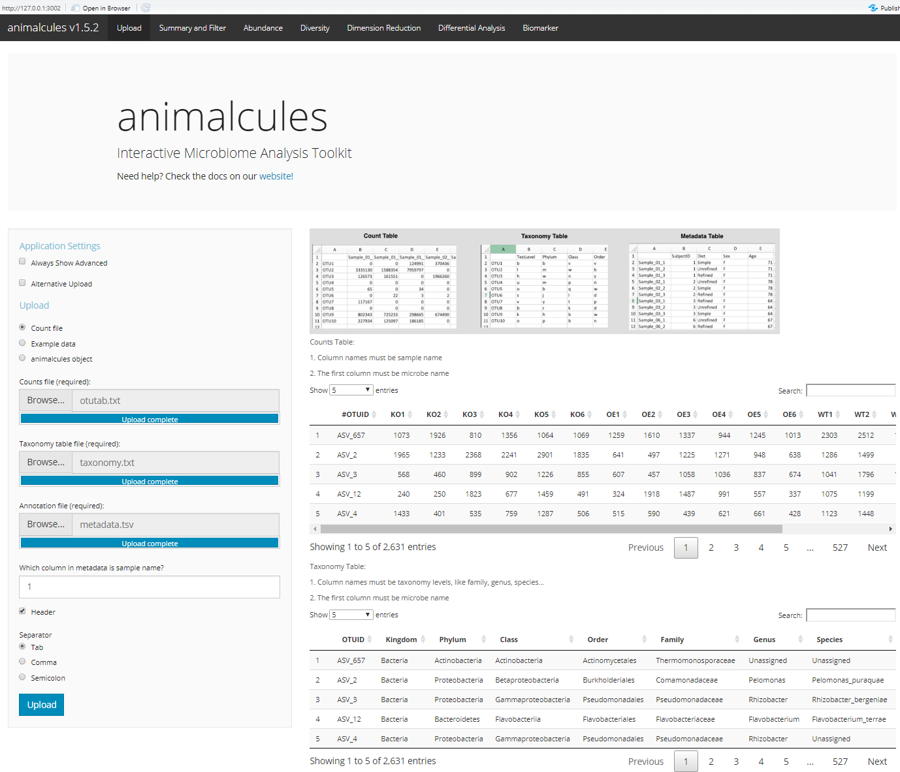

这里我们准备了自己的示例文件，也是为保证尽可能的将这个工具变成一种普通工具，供大家使用。

```{R eval=FALSE, include=FALSE}

run_animalcules()
```


### 开始分析-基础统计


写在前面： 往下的部分，我会同时运行Shiny和官方代码教程，并作比对，但是不会深入挖掘，仅仅会帮助大家完成官方教程和提出一些建议。其次虽然我们也构建MAE文件，但是由于作者代码有一些小瑕疵，所以使用官方数据做演示。

这部分用于统计每个样本中OTU的数量，并做两种方式可视化：频率曲线，箱线 + 散点图；如果使用shiny程序的话，直接可以展示表格。
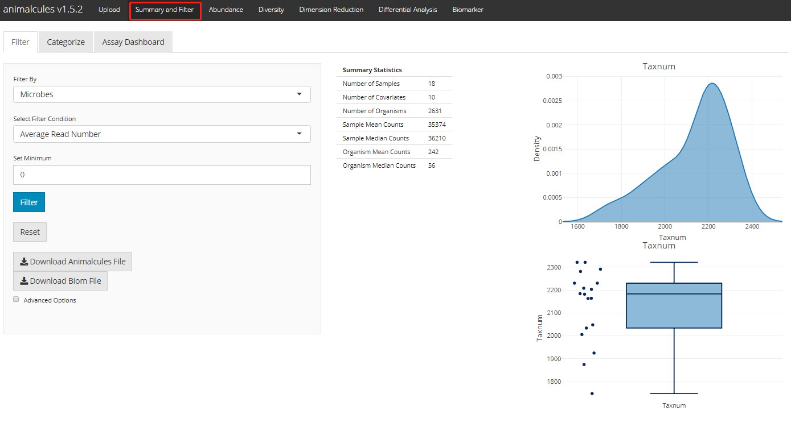

此外，可以按照微生物分类水平合并OTU数据：
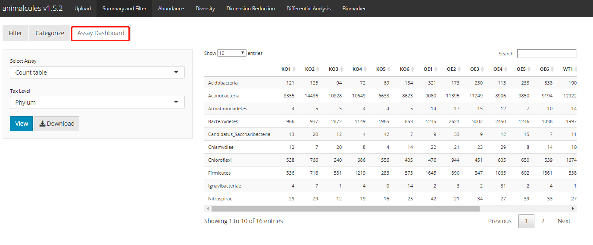


- samples_discard : 需要去除样本的id

```{R}
# ?filter_summary_pie_box
p <- filter_summary_pie_box(MAE,
                            samples_discard = c("subject_2", "subject_4"),
                            filter_type = "By Metadata",
                            sample_condition = "AGE")
p

```

更换分组，重新统计。

```{R}
p <- filter_summary_bar_density(MAE,
                                samples_discard = c("subject_2", "subject_4"),
                                filter_type = "By Metadata",
                                sample_condition = "SEX")
p

```


```{R}
#--提取子集，并且提取map文件
microbe <- MAE[['MicrobeGenetics']]
samples <- as.data.frame(colData(microbe))

result <- filter_categorize(samples,
                            sample_condition="AGE",
                            new_label="AGE_GROUP",
                            bin_breaks=c(0,55,75,100),
                            bin_labels=c('Young','Adult',"Elderly"))
head(result$sam_table)

```


```{R}
result$plot.binned

```

### 微生物组数据分析-微生物丰度展示-堆叠柱状图

通过tax_level选择某个分类等级，通过 sample_conditions 选择需要添加的分组标签。值得注意的是这里可以对堆叠柱状图排序的，通过order_organisms来指定，默认丰度从高到低。这里从源代码来看就是通过改变factor来实现的，所以图例第一个也是排序的这个微生物。

```{R}
p <- relabu_barplot(MAE,
                    tax_level="family",
                    order_organisms=c('Retroviridae'),
                    sort_by="organisms",
                    sample_conditions=c('SEX', 'AGE'),
                    show_legend=TRUE)
p

```

shiny版本:
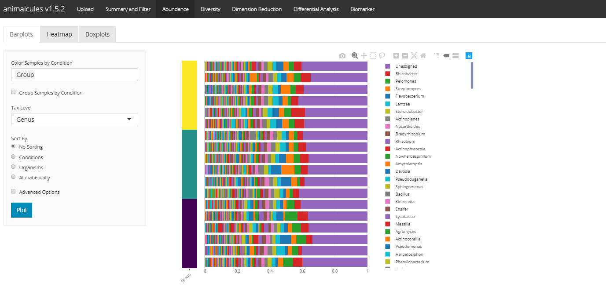


### 微生物组数据分析-微生物丰度展示-热图


```{R}
p <- relabu_heatmap(MAE,
                   tax_level="genus",
                   sort_by="conditions",
                   sample_conditions=c("SEX", "AGE"))
p

```

shiny版本:
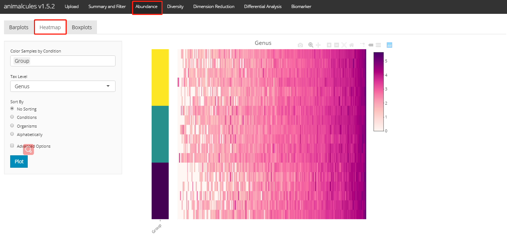

### 微生物组数据分析-特定微生物丰度展示-箱线图


```{R}
p <- relabu_boxplot(MAE,
                    tax_level="genus",
                    organisms=c("Escherichia", "Actinomyces"),
                    condition="SEX",
                    datatype="logcpm")
p

```

shiny版本:
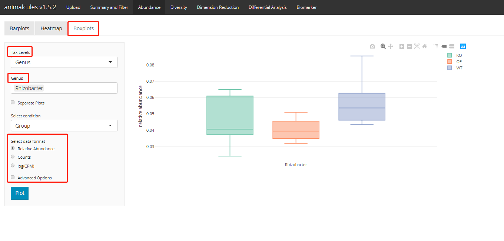


### 微生物组数据分析-多样性-alpha多样性

这里只有四个多样性指标。然后通过箱线+散点图展示。

```{R}
alpha_div_boxplot(MAE = MAE,
                  tax_level = "genus",
                  condition = "DISEASE",
                  alpha_metric = "shannon")

```

对多样性进行统计检验。这里可选的是"Wilcoxon rank sum test", "T-test", "Kruskal-Wallis"这三种方法。

```{R}
# ?do_alpha_div_test
do_alpha_div_test(MAE = MAE,
                  tax_level = "genus",
                  condition = "DISEASE",
                  alpha_metric = "shannon",
                  alpha_stat = "T-test")

```

shiny版本:
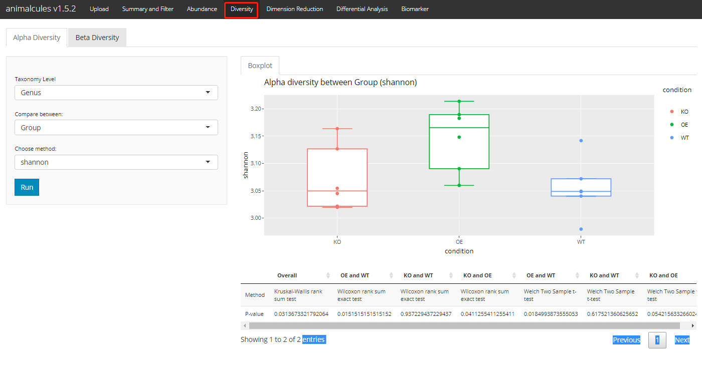

### 微生物组数据分析-多样性-beta多样性-聚类距离热图


```{R}
diversity_beta_heatmap(MAE = MAE, 
                       tax_level = 'genus', 
                       input_beta_method = "bray",
                       input_bdhm_select_conditions = 'DISEASE',
                       input_bdhm_sort_by = 'condition')

```

其次通过组内距离和组件距离的箱线图展示

```{R}
diversity_beta_boxplot(MAE = MAE, 
                       tax_level = 'genus', 
                       input_beta_method = "bray",
                       input_select_beta_condition = 'DISEASE')

```

再有就是统计检验,共有三种方法可以选择：PERMANOVA,Kruskal-Wallis,Wilcoxon test。
但是只有两种距离可供选择，其次就是两两比较不能实现。

```{R}
# ?diversity_beta_test
diversity_beta_test(MAE = MAE, 
                    tax_level = 'genus',
                    input_beta_method = "bray",
                    input_select_beta_condition =  'DISEASE',
                    input_select_beta_stat_method = 'PERMANOVA',
                    input_num_permutation_permanova = 999)

```

shiny版本:
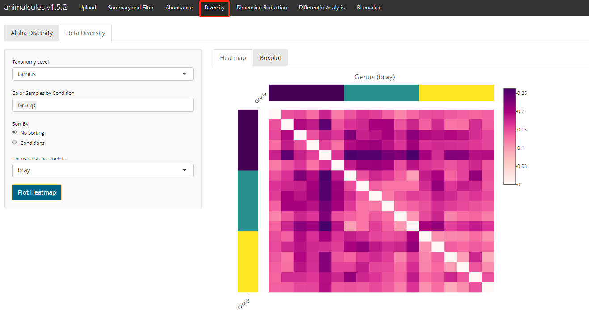
shiny版本(error):
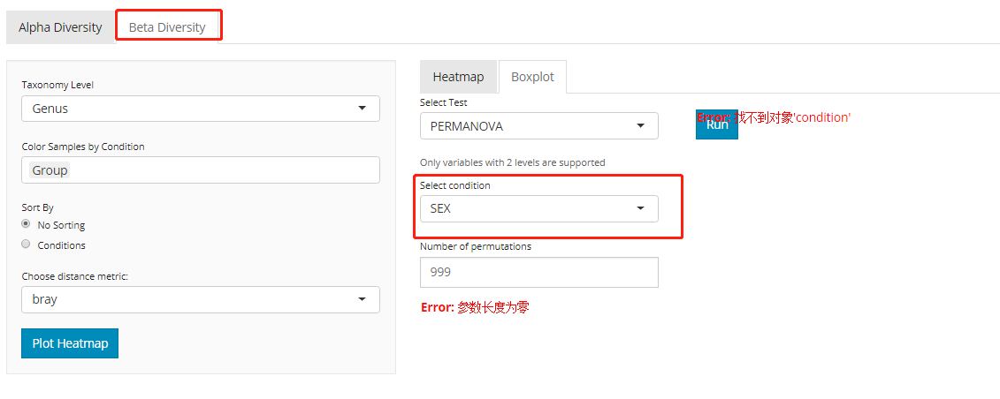

### 微生物组数据分析-排序 四种方法

PCA

```{R}
result <- dimred_pca(MAE,
                     tax_level="genus",
                     color="AGE",
                     shape="DISEASE",
                     pcx=1,
                     pcy=2,
                     datatype="logcpm")
result$plot

```

PCoA

```{R}
result <- dimred_pcoa(MAE,
                      tax_level="genus",
                      color="AGE",
                      shape="DISEASE",
                      axx=1,
                      axy=2,
                      method="bray")
result$plot

```

UMAP

```{R}

esult <- dimred_umap(MAE,
                      tax_level="genus",
                      color="AGE",
                      shape="DISEASE",
                      cx=1,
                      cy=2,
                      n_neighbors=15,
                      metric="euclidean",
                      datatype="logcpm")
result$plot
```

t-SNE，除了二维图形展示还可以进行三维图形的展示。


```{R}
result <- dimred_tsne(MAE,
                      tax_level="phylum",
                      color="AGE",
                      shape="GROUP",
                      k="3D",
                      initial_dims=30,
                      perplexity=10,
                      datatype="logcpm")

```

shiny版本:
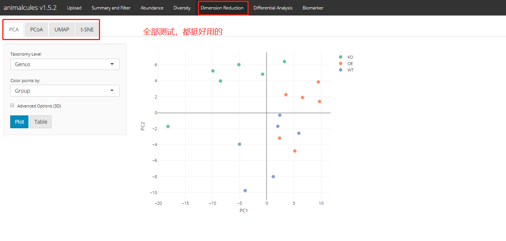

### 微生物组数据分析-差异分析


```{R}
p <- differential_abundance(MAE,
                            tax_level="phylum",
                            input_da_condition=c("DISEASE"),
                            min_num_filter = 2,
                            input_da_padj_cutoff = 0.5)
p

```

shiny版本:
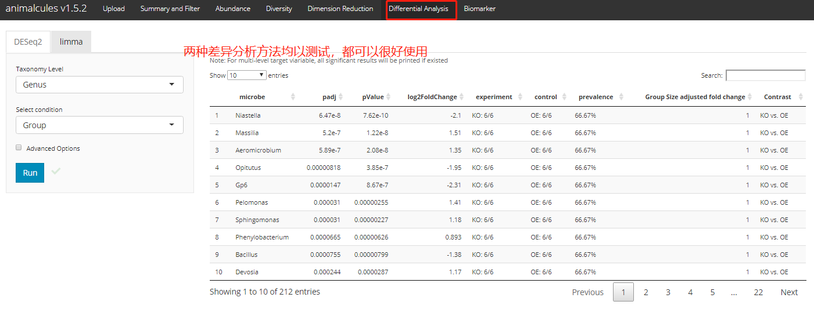

### 微生物组数据分析-生物标记物分析

这里可选的方法有两个："logistic regression", "random forest"。


```{R}
# ?find_biomarker
p <- find_biomarker(MAE,
                    tax_level = "genus",
                    input_select_target_biomarker = c("SEX"),
                    nfolds = 3,
                    nrepeats = 3,
                    seed = 99,
                    percent_top_biomarker = 0.2,
                    model_name = "logistic regression")
# biomarker
p$biomarker

```

对重要变量可视化。

```{R}

# importance plot
p$importance_plot

```

ROC曲线准确度评估。注意ROC曲线只能对二分便量进行操作。

```{R}
# ROC plot
p$roc_plot

```

shiny版本(error):
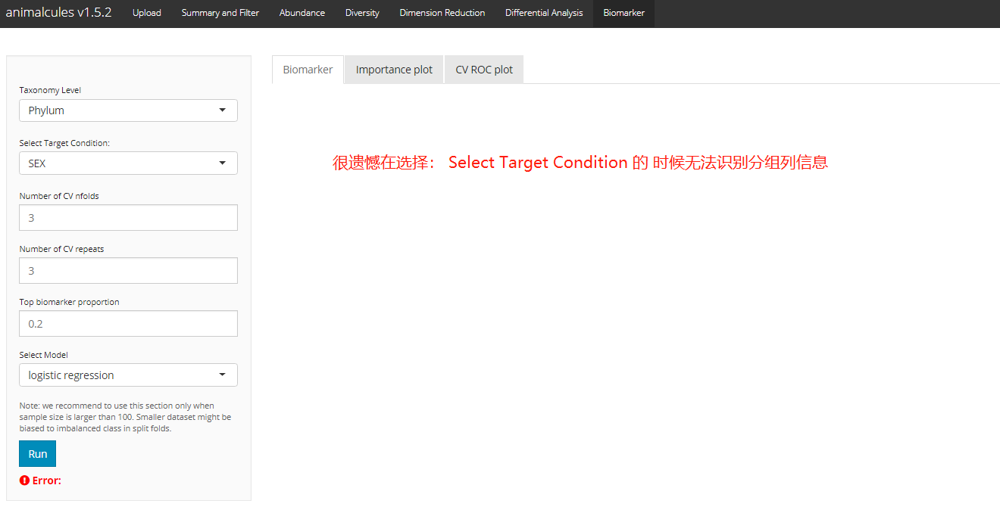

```{R}

sessionInfo()


```

## reference

- https://bioconductor.org/packages/release/bioc/vignettes/animalcules/inst/doc/animalcules.html

